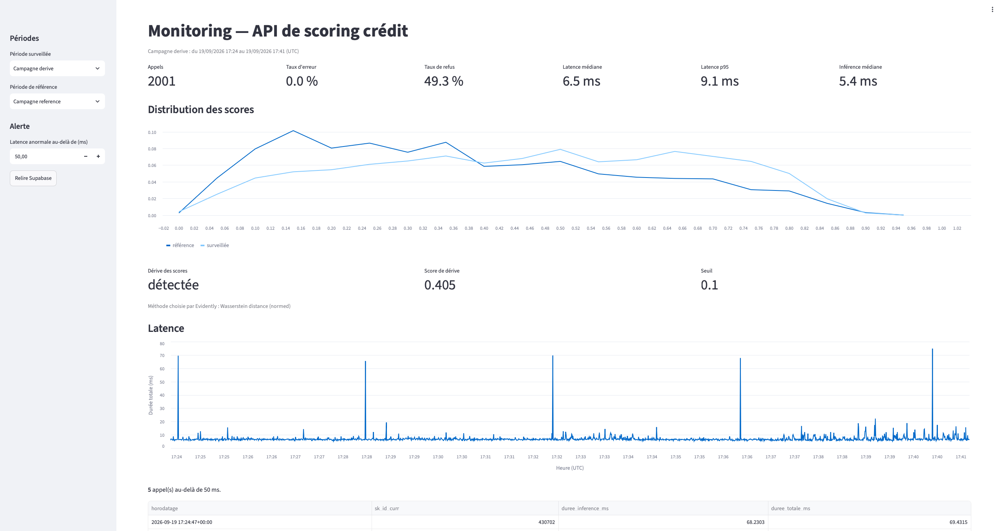

# API de scoring crédit — Home Credit

[](https://github.com/FatiQpi/home-credit-scoring-api/actions/workflows/ci.yml)

API REST qui retourne un score de risque de défaut pour un client de l'organisme Home Credit, à partir d'un modèle LightGBM entraîné sur le jeu de données [Home Credit Default Risk](https://www.kaggle.com/competitions/home-credit-default-risk).

L'API reçoit **un identifiant client**. Elle lit les 145 features de ce client dans un magasin chargé au démarrage, applique le modèle, et renvoie un score accompagné d'une décision.

> Projet 8 du parcours **AI Engineer** — déploiement et monitoring d'un modèle de scoring crédit. Le modèle lui-même provient du projet 6.

---

## Sommaire

- [Fonctionnement](#fonctionnement)
- [Prérequis](#prérequis)
- [Démarrage rapide avec Docker](#démarrage-rapide-avec-docker)
- [Installation locale](#installation-locale)
- [Référence de l'API](#référence-de-lapi)
- [Tests](#tests)
- [Déploiement](#déploiement)
- [Monitoring](#monitoring)
- [Structure du dépôt](#structure-du-dépôt)
- [Reconstruire le magasin](#reconstruire-le-magasin)
- [Modèle et données](#modèle-et-données)

---

## Fonctionnement

```
                 ┌──────────────────── au démarrage ─────────────────────┐
                 │  artifacts/feature_names.json  →  contrat d'entrée    │
                 │  artifacts/categories.json     →  modalités figées    │
                 │  data/store.parquet            →  307 505 × 145       │
                 │  artifacts/model.pkl           →  LightGBM            │
                 └───────────────────────────────────────────────────────┘

  POST /predict
  {"SK_ID_CURR": 100002}
          │
          ▼
   lecture par index  ──►  145 features  ──►  predict_proba  ──►  seuil 0,50
          │                                                            │
          ▼                                                            ▼
   identifiant absent → 404                          {"score_risque": 0.8344,
                                                      "decision": "REFUSE"}
```

**Aucune feature ne transite par la requête.** Le corps de la demande ne porte qu'un identifiant ; tout champ supplémentaire est rejeté en 422. Ce choix reflète l'usage visé : un conseiller bancaire saisit un numéro de dossier, pas 145 variables.

Les fichiers coûteux — modèle et magasin — sont chargés **une seule fois** au démarrage du service, via le gestionnaire `lifespan` de FastAPI, et réutilisés par toutes les requêtes. Un échec de chargement empêche le démarrage plutôt que de servir des requêtes vouées à l'erreur.

---

## Prérequis

| Pour | Il faut |
|---|---|
| Lancer le service | Docker |
| Développer et tester | Python 3.11 |
| Monitoring | Python 3.11 et un projet Supabase |

Le magasin de features (`data/store.parquet`, 40 Mo) est **versionné dans le dépôt** : un simple clone suffit, aucun téléchargement de données n'est nécessaire.

---

## Démarrage rapide avec Docker

```bash
git clone https://github.com/FatiQpi/home-credit-scoring-api.git
cd home-credit-scoring-api

docker build -t scoring-api .
docker run --rm -p 8000:7860 scoring-api
```

Sur une machine ARM (Mac Apple Silicon) destinée à produire une image pour une cible x86-64 :

```bash
docker build --platform linux/amd64 -t scoring-api .
```

Le conteneur écoute sur le port **7860** ; l'option `-p 8000:7860` le publie sur le port 8000 de la machine hôte. Le port interne est configurable par la variable d'environnement `PORT`.

Le service est prêt lorsque le journal affiche :

```
INFO:     Application startup complete.
INFO:     Uvicorn running on http://0.0.0.0:7860
```

Vérification, dans un second terminal :

```bash
curl http://localhost:8000/health
# {"status":"ok"}

curl -X POST http://localhost:8000/predict \
     -H "Content-Type: application/json" \
     -d '{"SK_ID_CURR": 100002}'
# {"SK_ID_CURR":100002,"score_risque":0.8344,"decision":"REFUSE","seuil":0.5}
```

---

## Installation locale

```bash
python3.11 -m venv venv
source venv/bin/activate          # Windows : venv\Scripts\activate

pip install -r requirements.txt   # service seul
pip install -r requirements-dev.txt   # service + outils de test

python -m uvicorn src.api:app --reload
```

Le service écoute alors sur `http://127.0.0.1:8000`.

Sans les variables `SUPABASE_URL` et `SUPABASE_KEY`, chaque appel est journalisé dans le terminal uniquement, rien n'est envoyé à Supabase.

---

## Référence de l'API

Documentation interactive générée automatiquement, une fois le service lancé :

| Interface | URL |
|---|---|
| Swagger UI | `http://localhost:8000/docs` |
| ReDoc | `http://localhost:8000/redoc` |
| Schéma OpenAPI | `http://localhost:8000/openapi.json` |

### `POST /predict`

Retourne le score de risque d'un client identifié.

**Corps de la demande**

| Champ | Type | Contrainte |
|---|---|---|
| `SK_ID_CURR` | entier | strictement positif, **seul champ accepté** |

```json
{"SK_ID_CURR": 100002}
```

**Réponse — `200 OK`**

| Champ | Type | Description |
|---|---|---|
| `SK_ID_CURR` | entier | l'identifiant repris de la demande |
| `score_risque` | flottant | score entre 0 et 1, arrondi à 4 décimales |
| `decision` | `"ACCORDE"` ou `"REFUSE"` | résultat de la comparaison au seuil |
| `seuil` | flottant | seuil appliqué, `0.5` |

```json
{
  "SK_ID_CURR": 100002,
  "score_risque": 0.8344,
  "decision": "REFUSE",
  "seuil": 0.5
}
```

> **`score_risque` classe les clients du moins au plus risqué, mais ce n'est pas une probabilité de défaut** : le modèle a été entraîné avec un rééquilibrage des classes (`is_unbalance=True`), qui gonfle les scores.

**Codes d'erreur**

| Code | Cause | Exemple de corps |
|---|---|---|
| `404` | identifiant bien formé, mais absent du magasin | `{"SK_ID_CURR": 999999999}` |
| `422` | demande malformée | champ manquant, type incorrect, valeur négative ou nulle, champ surnuméraire |

La distinction est délibérée : un `422` signale une demande invalide, un `404` une demande valide portant sur une ressource inexistante.

```bash
# 404
curl -X POST http://localhost:8000/predict \
     -H "Content-Type: application/json" \
     -d '{"SK_ID_CURR": 999999999}'
# {"detail":"Aucune donnee pour le client 999999999."}

# 422 — champ surnuméraire
curl -X POST http://localhost:8000/predict \
     -H "Content-Type: application/json" \
     -d '{"SK_ID_CURR": 100002, "AMT_CREDIT": 500000}'
```

### `GET /health`

Sonde de vivacité, destinée aux plateformes d'hébergement.

```json
{"status": "ok"}
```

Renvoie `"degraded"` si le modèle ou le magasin ne sont pas chargés.

---

## Tests

```bash
source venv/bin/activate
python -m pytest                                  # 36 tests
python -m pytest --cov=src --cov-report=term      # avec la couverture
```

**36 tests, 99 % de couverture sur `src/`** (`api.py` et `journal.py` à 100 %).

| Fichier | Couvre |
|---|---|
| `tests/test_features.py` | artefacts, gardes du chargement, lecture par index, règle de décision |
| `tests/test_api.py` | codes 200 / 404 / 422, contrat de réponse, sonde, schéma OpenAPI |
| `tests/test_journal.py` | journalisation (`src/journal.py`) |

Les fixtures de `tests/conftest.py` sont de portée *session* : le magasin de 40 Mo est lu une seule fois pour l'ensemble de la suite. Une fixture automatique retire `SUPABASE_URL` et `SUPABASE_KEY` de l'environnement : la suite n'écrit jamais dans la table de production.

### Contrôle de parité

`scripts/check_parity.py` vérifie que le vecteur lu dans le magasin est **identique** à celui produit lors de l'entraînement pour le même client — égalité stricte des probabilités, sur les 307 505 clients. C'est la garantie qu'aucun écart n'existe entre entraînement et inférence.

```bash
python scripts/check_parity.py            # passage complet
python scripts/check_parity.py --rapide   # échantillon
python scripts/check_parity.py 100002     # identifiants imposés
```

> Ce script lit le CSV d'entraînement d'origine, **absent du dépôt**. Il n'est exécutable que sur une machine disposant des données sources du projet 6.

---

## Déploiement

| | |
|---|---|
| Service en ligne | https://fatih09-home-credit-scoring-api.hf.space (documentation : `/docs`) |
| Space Hugging Face | https://huggingface.co/spaces/Fatih09/home-credit-scoring-api (SDK Docker) |

Le Space se met en veille sans trafic : le premier appel après une période d'inactivité est lent.

Le pipeline `.github/workflows/ci.yml` s'exécute à chaque push sur `main` et sur les branches `feature/**`.

| Job | Rôle | Branches |
|---|---|---|
| `test` | installe `requirements-dev.txt` et lance la suite de tests | toutes |
| `build` | construit l'image, la démarre et vérifie le score `0.8344` du client 100002 | toutes |
| `deploy` | clone le dépôt du Space, y copie les fichiers de l'image (`Dockerfile`, `requirements.txt`, `src/`, trois artefacts, magasin), puis pousse s'il y a un changement ; le Space reconstruit l'image | `main` uniquement |

Chaque job ne démarre que si le précédent a réussi. `main` est protégée : on n'y fusionne que par pull request.

| Secret | Déclaré dans | Usage |
|---|---|---|
| `HF_TOKEN` | GitHub | push vers le dépôt du Space |
| `SUPABASE_URL`, `SUPABASE_KEY` | réglages du Space | journalisation vers Supabase |

---

## Monitoring

Chaque appel à `/predict` répondant 200 ou 404 produit une ligne dans la table Supabase `journal_predictions`. L'écriture a lieu après l'envoi de la réponse : elle ne pèse ni sur la latence ni sur le code de retour. Les 422 ne sont pas journalisés (rejetés par Pydantic avant la route), les 500 non plus.

### Installation

```bash
source venv/bin/activate
pip install -r requirements-monitoring.txt
```

Créer un fichier `.env` à la racine (ignoré par Git) :

```
SUPABASE_URL=https://<identifiant-du-projet>.supabase.co
SUPABASE_KEY=<clé secrète du projet>
```

La table a le *Row Level Security* activé sans aucune politique : la clé publique n'y a aucun accès. Il faut la **clé secrète**, qui contourne ce filtrage — à ne jamais commiter.

### Tableau de bord

```bash
python -m streamlit run monitoring/dashboard.py
```

S'ouvre sur `http://localhost:8501`. La barre latérale choisit la période surveillée, la période de référence (toute la table ou une campagne) et le seuil de latence anormale. Les données sont gardées en cache 5 minutes ; le bouton « Relire Supabase » force la relecture.



### Notebook d'analyse de dérive

Ouvrir `notebooks/analyse_derive.ipynb` dans VS Code ou JupyterLab avec le noyau du `venv` (`ipykernel` est installé, pas Jupyter). Le notebook lit les manifestes de `data/campagnes/`, relit les lignes correspondantes dans Supabase, reconstitue les 145 features de chaque client depuis le magasin et compare les périodes avec Evidently. Les rapports HTML sont écrits dans `rapports/`, non versionné ; leurs captures sont dans `captures/`.

### Rejouer une campagne

```bash
python scripts/injecter.py reference --url https://fatih09-home-credit-scoring-api.hf.space
python scripts/injecter.py derive    --url https://fatih09-home-credit-scoring-api.hf.space
```

2 000 appels par campagne à 2 requêtes/s, soit environ 17 minutes. `reference` tire des clients au hasard dans le magasin, `derive` uniquement parmi les 34 ans ou moins. Les appels sont journalisés dans la table de production ; le script écrit un manifeste `data/campagnes/<mode>_<date>.json`. Le notebook exige un seul manifeste par mode : déplacer les anciens avant de relancer.

### Interpréter le monitoring

| Indicateur | Ce qu'il mesure | À surveiller |
|---|---|---|
| Taux d'erreur | part des statuts ≠ 200 — en pratique des 404 | hausse : des identifiants absents du magasin sont demandés |
| Taux de refus | part des décisions `REFUSE` (score ≥ 0,50) | écart durable avec la période de référence |
| Latence médiane / p95 | durée de traitement dans l'API, hors réseau ; la médiane décrit l'appel typique, le p95 les appels lents | p95 en hausse |
| Inférence médiane | calcul du modèle seul | si elle suit la latence, le ralentissement vient du modèle |
| Distribution des scores | proportion d'appels par tranche de 0,05, période surveillée contre référence | glissement de la courbe : les clients ne sont plus jugés de la même façon |
| Score de dérive | dérive de `score_risque` calculée par Evidently ; la méthode s'affiche sous le chiffre | voir ci-dessous |
| Appels au-delà du seuil | appels plus lents que le seuil réglé (50 ms par défaut) | listés avec leur identifiant et leurs durées |

**Lire un score de dérive.** Evidently mesure une **distance** (Wasserstein normalisée pour les colonnes numériques, Jensen-Shannon pour les catégorielles) quand la référence compte plus de 1 000 valeurs : dérive si elle est **≥ 0,1**. En dessous, il applique un **test statistique** et rend une p-value : dérive si elle est **≤ 0,05**. Les deux règles vont en sens inverse. Pour comparer des rapports successifs, garder toujours la même période de référence.

**Lire le notebook.** Le nombre de colonnes en dérive se compare au **témoin négatif** — deux tirages au hasard du magasin, sans différence réelle — qui donne le bruit de fond du détecteur. Une colonne en dérive compte en proportion de son poids dans le modèle (`artifacts/permutation_importance.csv`). Le bandeau global d'Evidently ne déclare une dérive qu'à partir de 50 % de colonnes touchées : il ne suffit pas à conclure.

### Stockage des données de production

**Supabase** (PostgreSQL hébergé, offre gratuite, région `eu-west-1`), interrogé par son **API REST en HTTPS sur le port 443**. Un Space n'autorise en sortie que les ports 80, 443 et 8080 : la connexion PostgreSQL directe y est impossible.

```sql
create table journal_predictions (
  id                  bigint generated always as identity primary key,
  horodatage          timestamptz not null default now(),
  sk_id_curr          bigint,
  score_risque        double precision,
  decision            text,
  duree_inference_ms  double precision,
  duree_totale_ms     double precision,
  statut              smallint not null,
  version_api         text
);
alter table journal_predictions enable row level security;
```

Le journal stocke l'identifiant du client, pas ses 145 features : le magasin étant figé et versionné, l'identifiant suffit à les retrouver à l'identique.

| Mesure | Valeur |
|---|---|
| Table `journal_predictions`, index compris | 592 Ko pour 4 002 lignes, soit ≈ 150 octets par appel |
| Base entière | 11 Mo, sur 500 Mo offerts |

| Capture | Contenu |
|---|---|
| [`captures/supabase_table.png`](captures/supabase_table.png) | lignes réelles de la table |
| [`captures/supabase_schema.png`](captures/supabase_schema.png) | types des 9 colonnes |
| [`captures/temoin_negatif.png`](captures/temoin_negatif.png), [`captures/temoin_positif.png`](captures/temoin_positif.png) | rapports Evidently du témoin et de la campagne dérivée |

---

## Structure du dépôt

```
home-credit-scoring-api/
├── .github/workflows/ci.yml         pipeline test → build → deploy
├── artifacts/
│   ├── model.pkl                    modèle LightGBM sérialisé
│   ├── feature_names.json           les 145 features, dans l'ordre attendu
│   ├── categories.json              modalités figées des 16 colonnes catégorielles
│   └── permutation_importance.csv
├── captures/                        tableau de bord, Supabase, rapports Evidently
├── data/
│   ├── store.parquet                307 505 clients × 145 features, 40 Mo
│   └── campagnes/                   manifestes des campagnes injectées
├── monitoring/
│   └── dashboard.py                 tableau de bord Streamlit
├── notebooks/
│   └── analyse_derive.ipynb         analyse de la dérive (Evidently)
├── scripts/
│   ├── build_store.py               construit le magasin depuis les CSV sources
│   ├── check_parity.py              contrôle de parité entraînement / inférence
│   └── injecter.py                  simule le trafic de production
├── src/
│   ├── api.py                       routes, gestion des erreurs, cycle de vie
│   ├── features.py                  chargement des artefacts, lecture, prédiction
│   ├── journal.py                   journalisation : sortie standard puis Supabase
│   └── schemas.py                   contrats d'entrée et de sortie (Pydantic)
├── tests/
│   ├── conftest.py                  fixtures
│   ├── test_api.py                  couche HTTP
│   ├── test_features.py             couche métier
│   └── test_journal.py              journalisation
├── Dockerfile
├── .dockerignore
├── pytest.ini
├── requirements.txt                 API : 8 dépendances directes, versions figées
├── requirements-dev.txt             API + outils de test
└── requirements-monitoring.txt      API + Evidently, Supabase, Streamlit…
```

L'image Docker ne reçoit que ce qui est nécessaire à l'exécution : `src/`, trois artefacts, le magasin et `requirements.txt`. Tests, scripts hors ligne, monitoring et fichiers de développement en sont exclus.

---

## Reconstruire le magasin

Le magasin est un **artefact de déploiement**, solidaire de la version du modèle : il est versionné avec le code, et non produit à la volée. Le reconstruire n'est nécessaire que si le modèle ou son contrat d'entrée changent.

```bash
python scripts/build_store.py
```

Le script lit `artifacts/feature_names.json` et `artifacts/categories.json`, extrait les colonnes correspondantes du CSV d'entraînement, applique les types catégoriels, ordonne les colonnes selon le contrat, puis écrit le fichier Parquet.

> **Le CSV source n'est pas versionné.** Le chemin est codé en dur dans le script et pointe vers l'arborescence locale du projet 6. Cette étape n'est donc pas reproductible depuis un simple clone — c'est assumé : le magasin produit, lui, est dans le dépôt.

L'ordre des colonnes est vérifié à chaque démarrage du service. Un magasin dont les colonnes ne correspondent pas exactement au contrat, **ordre compris**, provoque un échec au démarrage : LightGBM identifie les features par position, et une seule colonne permutée fausserait tous les scores sans lever d'erreur.

---

## Modèle et données

| | |
|---|---|
| Algorithme | LightGBM 4.6.0, `LGBMClassifier`, 100 arbres |
| Features | 145, dont 16 catégorielles |
| Seuil de décision | 0,50 |
| Valeurs manquantes | prises en charge nativement par LightGBM, **sans imputation** |
| Jeu de données | [Home Credit Default Risk](https://www.kaggle.com/competitions/home-credit-default-risk) (Kaggle) |

### Pile technique

Python 3.11 · FastAPI · Uvicorn · Pydantic v2 · pandas · PyArrow · scikit-learn · LightGBM

Monitoring, exécuté en local et absent de l'image Docker : Supabase · Evidently 0.7.23 · Streamlit 1.64.0 · Altair

Les huit dépendances directes sont figées à une version précise dans `requirements.txt`. `scikit-learn` et `pyarrow` n'apparaissent pas dans les imports du code applicatif mais sont indispensables à l'exécution : la première au désérialisage du modèle, la seconde comme moteur de lecture Parquet.

---

## Licence

Projet réalisé dans un cadre pédagogique. Les données sont soumises aux conditions d'utilisation de la compétition Kaggle dont elles proviennent.
